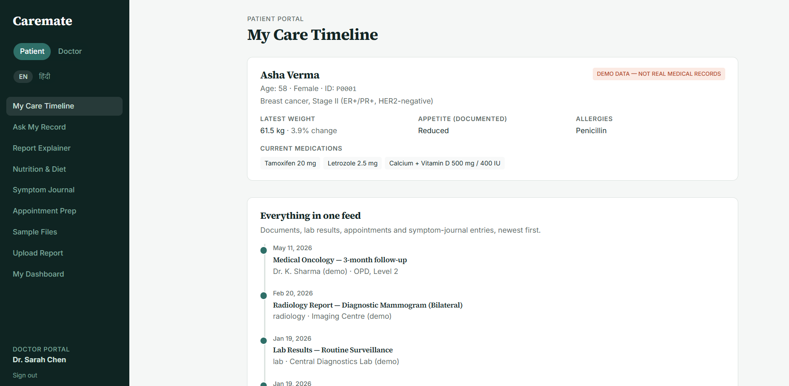

# Caremate AI

[](https://github.com/richiupadhyay2002-maker/CareMate-AI/actions/workflows/tests.yml)

A demonstration healthcare project with two parts:

- a **Python API** (FastAPI, SQLAlchemy) with authentication, patient-scoped
  data access, document ingestion, and a safety-checked, provider-agnostic RAG
  and six-agent pipeline, covered by a pytest suite; and
- a **Next.js frontend** for patients and doctors that runs as a self-contained
  demo on synthetic data (see [Frontend demo mode](#frontend-demo-mode)).

> **Medical disclaimer:** Caremate AI is a demonstration and information tool,
> not a medical device or substitute for professional medical advice,
> diagnosis, or treatment. It does not make clinical decisions. For medical
> concerns, consult a qualified healthcare professional; in an emergency,
> contact your local emergency number.
>
> **Synthetic data:** The included demo records, sample patients, reports, and
> screenshots are synthetic demonstration data, not real medical records.
> Do not commit real patient information, credentials, or private uploads.

## Demo

- [Watch or download the Caremate AI demo recording (MP4)](recordings/caremate-demo.mp4)



## Features

- **Frontend:** Next.js and React patient and doctor portals for reports,
  timeline, symptom journal, nutrition, and dashboards (demo mode, see below).
- **API and database:** FastAPI, SQLAlchemy persistence, SQLite by default
  (PostgreSQL + pgvector supported), Alembic migrations, JWT authentication,
  doctor/patient role checks, and patient-scoped data access.
- **RAG pipeline:** Section-aware document chunking, patient-isolated
  retrieval, hybrid BM25 + embedding search, citations, and structured
  responses. The API stores chunks in the database (`caremate/db/vector_store.py`:
  pgvector on PostgreSQL, cosine similarity in Python on SQLite); the
  standalone CLI pipeline uses an in-memory FAISS store
  (`caremate/retrieval/vector_store.py`).
- **Six-agent workflow:** Document, retrieval, summarization, citation, safety,
  and response agents.
- **Safety checks:** Prompt-injection detection, emergency red-flag symptom
  handling, and drug-food interaction checks.
- **Provider options:** Mock providers for offline development, with optional
  OpenAI, Anthropic, and Groq integrations.

## Quick Start

### Python API and tests

Requires Python 3.10 or newer.

```bash
python -m pip install -e ".[dev]"
pytest -q
python -m caremate.cli
```

Copy `.env.example` to `.env` to configure providers. The mock provider is the
default and does not require API keys.

Run the API from the project root:

```bash
uvicorn caremate.api.asgi:app --reload --port 8080
```

### Frontend

```bash
cd frontend
npm ci
npm run dev
```

The Next.js development server starts on port 3000 and uses
`http://localhost:8080` for the API by default. Set `NEXT_PUBLIC_API_URL` in
`frontend/.env.local` when the API runs at another URL.

To enable real LLM providers, install the optional integrations with
`python -m pip install -e ".[providers]"` and configure their API keys.

### Demo accounts

For local development the API seeds three demo accounts on startup (skipped
when `CAREMATE_FORCE_PROD_SECRETS=true`): `patient@caremate.ai`,
`doctor@caremate.ai`, and `admin@caremate.ai`. Their development-only
passwords are defined in `caremate/scripts/seed.py`; do not use them outside
local demos.

### Frontend demo mode

The frontend's AI features (Ask, Nutrition, Reports, Dashboard insights,
Doctor Ask/Risk, Appointments, Journal) run on `frontend/src/lib/ai-engine.ts`,
a deterministic, template-based engine over the synthetic record in
`frontend/src/lib/demo-data.ts`, so the deployed demo works without an API or
LLM keys. These pages do not call the Python RAG pipeline. The backend
pipeline is exercised through the API (`POST /patients/{patient_id}/ask`, see `/docs`), the CLI,
and the test suite; `frontend/src/lib/api.ts` contains the API client.

### Verification status

The pytest suite and the frontend production build run without external
services. Real LLM providers (OpenAI, Anthropic, Groq) and PostgreSQL/pgvector
are supported in code but are not exercised by the test suite or CI.

## Safety Test Results

These are pass rates for the small, hand-authored regression examples in the
automated test suite—not clinical performance metrics or guarantees on
unseen inputs:

| Regression check | Passing examples | Observed result |
| --- | ---: | ---: |
| Prompt-injection examples detected | 4/4 | 100% |
| Benign health question not flagged as injection | 1/1 | 100% |
| Red-flag symptom cases short-circuited | 4/4 | 100% |
| Routine nutrition question not short-circuited | 1/1 | 100% |
| Mock provider refused the tested injection prompt | 1/1 | 100% |

These figures describe only the examples in `tests/test_prompt_injection.py`
and `tests/test_red_flag_short_circuiting.py`; they should not be interpreted
as real-world detection or block rates.

## Project Structure

```text
caremate/                 Python API, agents, providers, retrieval, guardrails
  api/                    API endpoints and application setup
  db/                     Database models, repositories, and sessions
  agents/                 Six pipeline agents
  guardrails/             Injection, symptom, and interaction checks
  retrieval/              Chunking, embeddings, hybrid retriever, in-memory FAISS store
  orchestration/          API ask/nutrition flows over the database-backed vector store
  scripts/                Demo data seeding
frontend/                 Next.js patient and doctor web application (demo mode)
alembic/                  Database migrations (alembic/versions/)
tests/                    Python unit, API, database, and security tests
docs/                     Architecture documentation and demo screenshot
recordings/               Project demonstration video
```

## Database

The API uses SQLite by default (`caremate.db`) for local development and
supports PostgreSQL with pgvector. Database connections are configured with
`CAREMATE_DATABASE_URL`; database files, vector indexes, local uploads, and
other generated data are ignored by Git.
See [docs/architecture.md](docs/architecture.md) for architecture and
configuration details.

## Continuous Integration

GitHub Actions runs the Python test suite on pushes and pull requests to `main`.
The badge at the top of this README reports the workflow's latest status.
